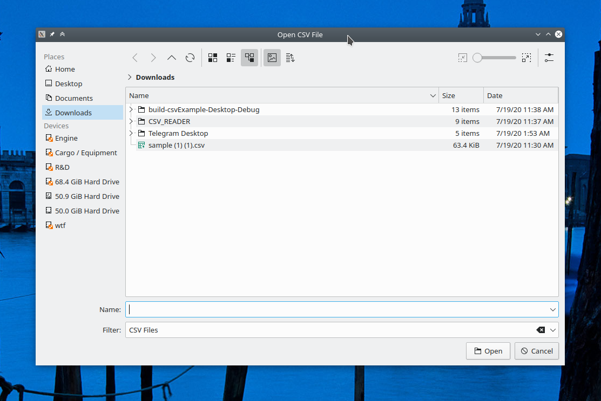
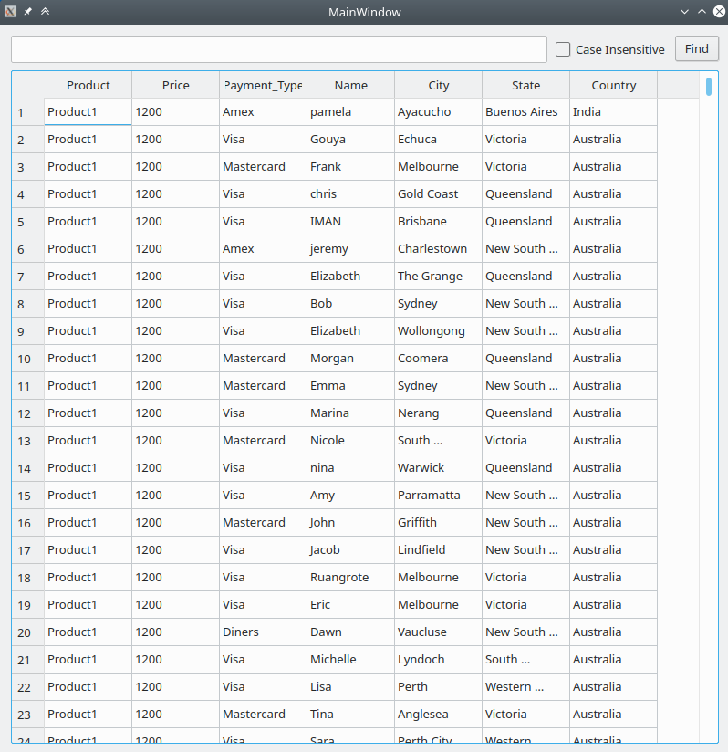
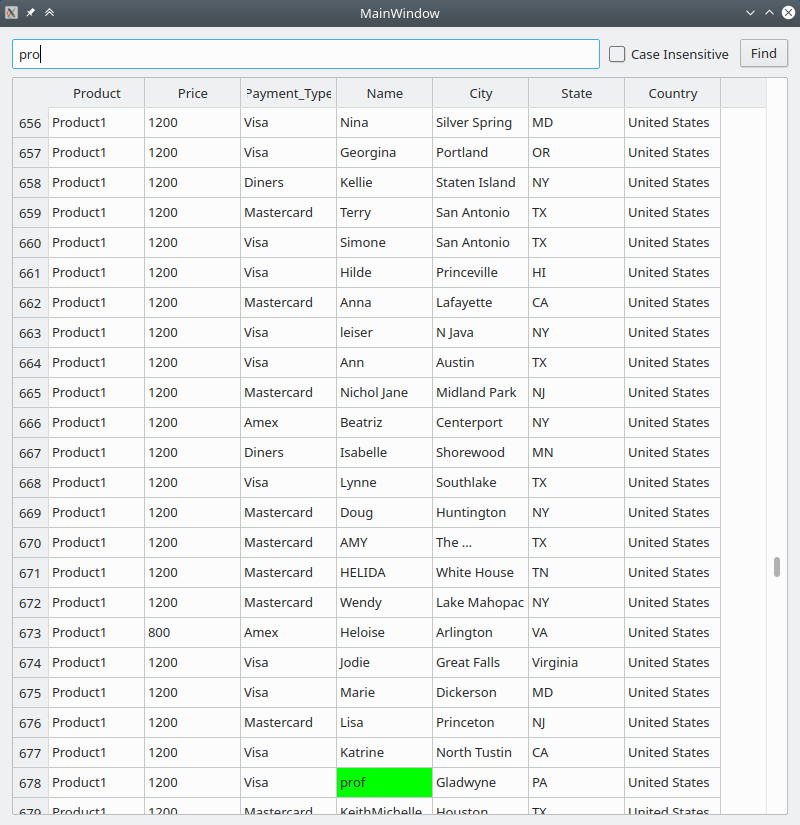
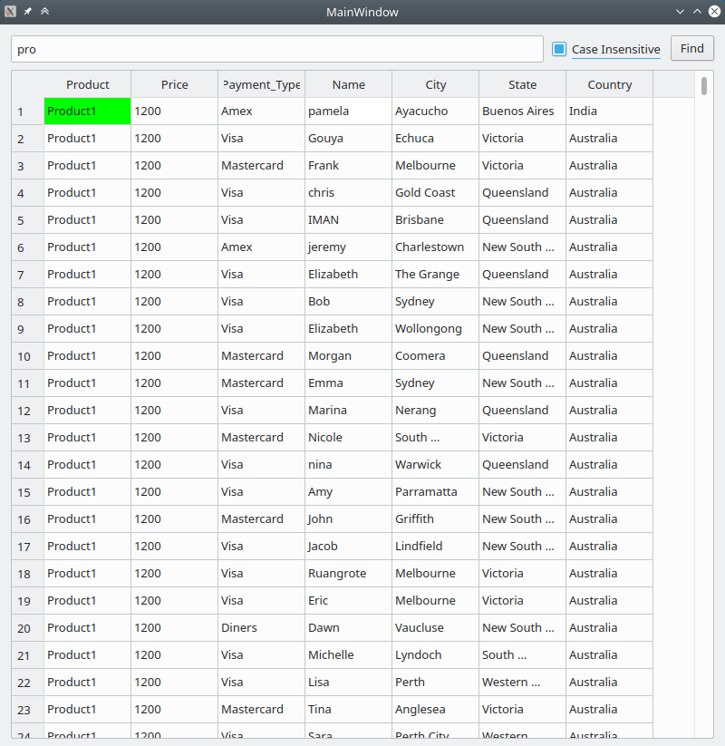

# CSV Editor
CSV Editor implemented with QTableView and QStandardItemModel

## Features
- Supply any CSV to the program through the file explorer.
- Find feature with Ctrl+F support, Enter key support, Find button, and live searching.
    - also features a switch for Case Insensitive searching
    - matched cell gets colored (Green at the time of writing)
- live saving as and when a cell is edited
- sort with respect to any column

## How to Build/ Run
- simply load the project file `.pro` in Qt Creator and run the project.
- feel free to uncomment last line in `.pro` to get a separate console windows with any debug logs.

## TODO
- look for [TODO] in code comments.

## Gallery

